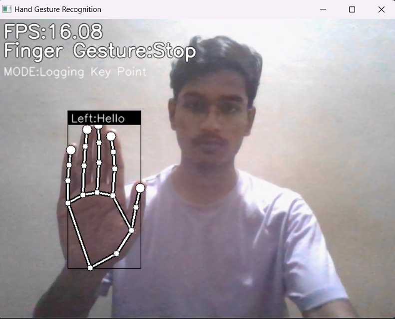
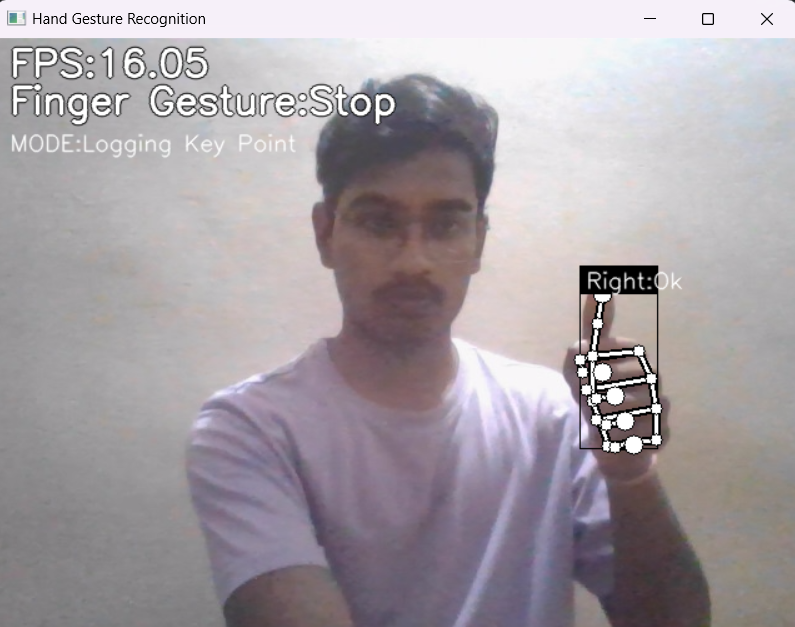
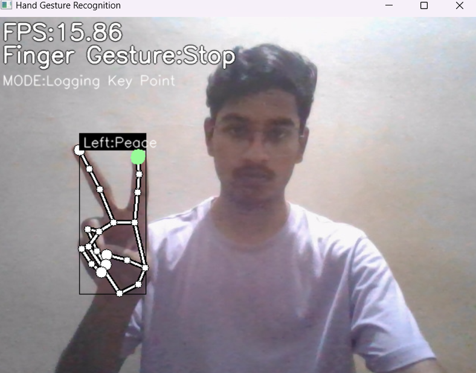
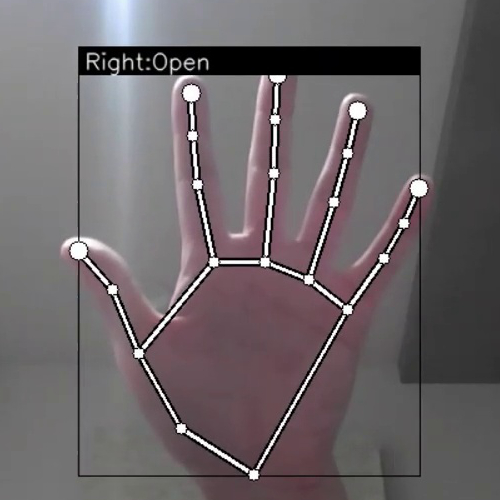
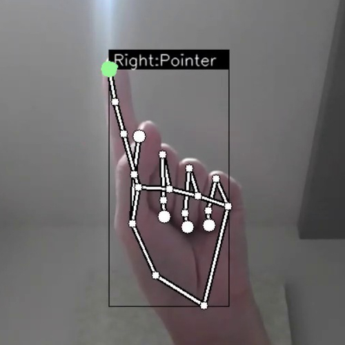

# ✋ Sign Language Detection (Sign Sense) using MediaPipe

A real-time system for recognizing hand signs and finger gestures using **MediaPipe**, **TensorFlow Lite**, and **OpenCV**.  
Inspired by [Kazuhito Takahashi’s original repository](https://github.com/Kazuhito00/hand-gesture-recognition-using-mediapipe) and rebuilt for clarity, training flexibility, and visual polish.

---

## 📦 Repository Contents

- `app.py`: Main script for real-time detection  
- `keypoint_classification.ipynb`: Static hand sign training  
- `point_history_classification.ipynb`: Dynamic gesture training  
- `model/`: Contains `.tflite` models, CSV training data, and label maps  
- `utils/`: Contains helper modules like `cvfpscalc.py` for FPS tracking

---

## 📋 Requirements

```bash
mediapipe==0.8.1
opencv-python>=4.0
tensorflow>=2.3.0
scikit-learn>=0.23.2
matplotlib>=3.3.2
```

If using an LSTM-based model:  
```bash
pip install tf-nightly
```

---

## 🚀 Run the Demo

```bash
python app.py
```

### Optional Flags

- `--device`: Camera device index (default: 0)  
- `--width`: Camera width (default: 960)  
- `--height`: Camera height (default: 540)  
- `--use_static_image_mode`: Use MediaPipe’s static mode  
- `--min_detection_confidence`: (default: 0.5)  
- `--min_tracking_confidence`: (default: 0.5)

🎥 Demo Preview

<video width="100%" height="auto" controls>
  <source src="media/demo.mp4" type="video/mp4">
  Your browser does not support the video tag.
</video>

---

## 🗂 Directory Overview

```
SignSense/
├── app.py
├── docs/
│   ├── demo.mp4
│   ├── gesture_left_hello.png
│   ├── gesture_right_ok.png
│   ├── gesture_peace.png
│   ├── open_hand.png
│   ├── close_hand.png
│   └── pointer.png
├── keypoint_classification.ipynb
├── point_history_classification.ipynb
├── model/
│   ├── keypoint_classifier/
│   │   ├── keypoint.csv
│   │   ├── keypoint_classifier.tflite
│   │   ├── keypoint_classifier_label.csv
│   │   └── keypoint_classifier.py
│   └── point_history_classifier/
│       ├── point_history.csv
│       ├── point_history_classifier.tflite
│       ├── point_history_classifier_label.csv
│       └── point_history_classifier.py
└── utils/
    └── cvfpscalc.py
```

---

## 🧠 Model Training

### 🔤 Hand Sign Recognition

#### 1. Data Collection Mode

- Press `k` to enter keypoint logging mode (`MODE: Logging Key Point`)
- Press number keys `0–9` to label gestures  
- Output stored in `model/keypoint_classifier/keypoint.csv`

📸 Logging Example:  


---

#### 2. Training the Model

- Open `keypoint_classification.ipynb`  
- Set `NUM_CLASSES` to match number of unique gestures  
- Edit `keypoint_classifier_label.csv` to define label names

📸 Prediction Results After Training:

<table>
  <tr>
    <td><strong>Right Hand OK</strong></td>
    <td><strong>Left Hand Peace</strong></td>
  </tr>
  <tr>
    <td></td>
    <td></td>
  </tr>
</table>

---

### ✋ Finger Gesture Recognition

#### 1. Data Collection Mode

- Press `h` to enter point history logging mode (`MODE: Logging Point History`)  
- Press number keys `0–9` to label movement paths  
- Output stored in `model/point_history_classifier/point_history.csv`

#### 2. Training the Model

- Open `point_history_classification.ipynb`  
- Set `NUM_CLASSES` and modify the `point_history_classifier_label.csv` file

---

## 📸 Gesture Preview Samples

<table>
  <tr>
    <th>Gesture</th>
    <th>Preview</th>
  </tr>
  <tr>
    <td>Open Hand ✋</td>
    <td></td>
  </tr>
  <tr>
    <td>Close Hand ✊</td>
    <td></td>
  </tr>
  <tr>
    <td>Pointer ☝️</td>
    <td></td>
  </tr>
</table>

---

## 📚 References

- [MediaPipe Documentation](https://mediapipe.dev/)  
- [Kazuhito Takahashi's Repo](https://github.com/Kazuhito00/hand-gesture-recognition-using-mediapipe)

---

## 📝 License

This project is licensed under the [MIT License](LICENSE).  
You are free to use, modify, and distribute this software under open-source terms.

---

> 📬 For suggestions, feel free to raise issues or contribute via pull requests.
